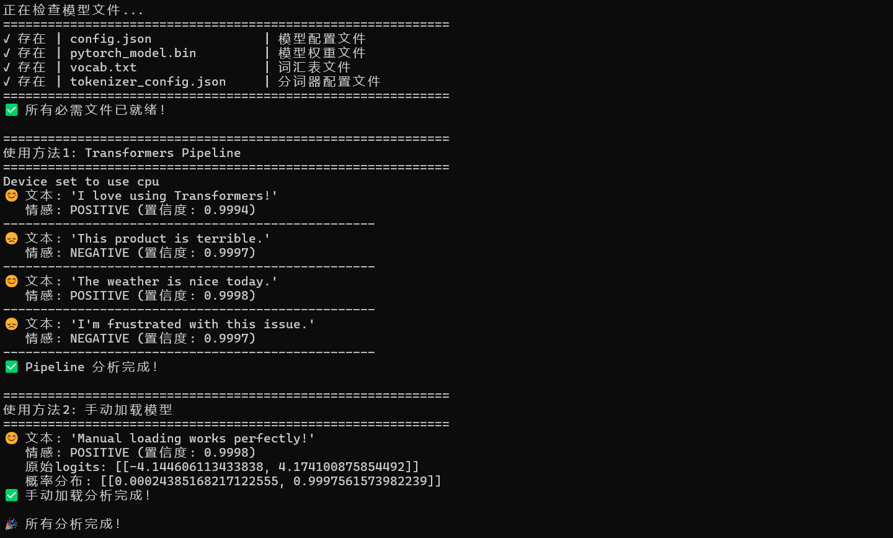

# sentiment-analysis-project
My first NLP project for sentiment analysis using Hugging Face Transformers.


# 情感分析 NLP 项目

这是我的第一个 NLP 项目，使用 Hugging Face Transformers 实现本地情感分析。
这是一个使用 Hugging Face Transformers 的本地情感分析工具，能判断英文文本是积极(😊)还是消极(😞)。
项目教会了电脑识别情感，虽然它可能永远理解不了人类为什么凌晨三点还在刷社交媒体。


## 项目功能
- 使用预训练的 DistilBERT 模型
- 支持两种分析方式：
  - Pipeline API（简单快捷）
  - 手动加载模型（灵活可控）
- 可分析任意英文文本的情感倾向

## 运行效果截图
  

## 如何运行

1. 克隆仓库：
```
   git clone https://github.com/ZYiHU/sentiment-analysis-project.git
   cd sentiment-analysis-project
```   

2. 安装依赖：
```
   pip install -r requirements.txt
```   

3. 下载模型文件：
   - [config.json](https://huggingface.co/distilbert/distilbert-base-uncased-finetuned-sst-2-english/raw/main/config.json)
   - [pytorch_model.bin](https://huggingface.co/distilbert/distilbert-base-uncased-finetuned-sst-2-english/resolve/main/pytorch_model.bin)
   - [vocab.txt](https://huggingface.co/distilbert/distilbert-base-uncased-finetuned-sst-2-english/raw/main/vocab.txt)
   - [tokenizer_config.json](https://huggingface.co/distilbert/distilbert-base-uncased-finetuned-sst-2-english/raw/main/tokenizer_config.json)
   
   将上述文件放入 `models/sentiment/` 目录

4. 运行主程序：
   python sentiment_analysis.py
   

## 项目结构
项目目录结构
sentiment-analysis-project/
```tree
sentiment-analysis-project/
sentiment-analysis-project/
├── models/                  # 模型目录
│   └── sentiment/           # 情感分析模型文件
├── sentiment_analysis.py    # 主程序
├── download_models.py       # 模型下载脚本
├── requirements.txt         # 依赖列表
├── README.md                # 本文件
└── .gitignore               # Git忽略配置
```

## 学习收获
在这个项目中，我学会了：
- 使用 Hugging Face Transformers 库
- 加载预训练模型
- 处理文本数据
- 进行情感分析
- 解决环境配置问题
- 使用Git管理代码

## 未来改进计划
- [ ] 添加交互式界面
- [ ] 支持更多语言
- [ ] 添加模型微调功能
- [ ] 部署为Web应用

# 许可证 
## MIT License - 基本意思是：

- 你可以随便用

- 但如果出了问题别来找我

- 如果赚了钱请我喝奶茶

项目地址：https://github.com/ZYiHU/sentiment-analysis-project
温馨提示：如果分析结果是负面情绪，建议吃点巧克力再试一次 🍫

